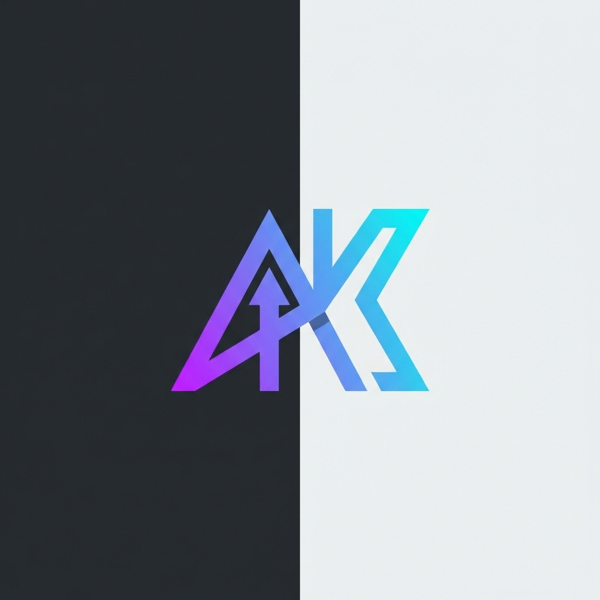

<p align="center">
  
</p>

<h1 align="center">AntiKit</h1>

<p align="center">
  <strong>Vibe Coding Framework for Google Antigravity</strong><br>
  <em>Transform AI chaos into production-ready code</em>
</p>

<p align="center">
  <a href="#the-story">Story</a> •
  <a href="#quick-start">Quick Start</a> •
  <a href="#command-pipeline">Commands</a> •
  <a href="#whats-included">What's Included</a>
</p>

<p align="center">
  <a href="README.vi.md">🇻🇳 Tiếng Việt</a> •
  <a href="README.zh.md">🇨🇳 中文</a> •
  <a href="README.ja.md">🇯🇵 日本語</a>
</p>

<p align="center">
  
  
  
  
  
</p>

---

## 🌟 The Story

*You discovered **Google Antigravity** — the revolutionary agent-first IDE.*

*You're excited. AI that actually writes code for you! Vibe coding at its finest!*

*Then reality hits...*

> 🧠 After 30 messages, the AI forgets your database schema and starts hallucinating tables

> 💥 The code "works" but crashes immediately in production

> 🔄 You fix one bug, three more appear. Endless debug loops.

> ❓ You stare at the screen with no idea what to do next

*Sound familiar?*

---

## ⚡ The Solution

**AntiKit is the missing piece.**

A framework of **20 workflows**, **16 AI agents**, and **40 deep skills** that transforms Antigravity from a powerful tool into a complete development operating system.

| Without AntiKit | With AntiKit |
|-----------------|--------------|
| "AI forgot my schema again" | `/recap` restores full context |
| Random bugs after every fix | `/code` includes automatic tests |
| "What do I do next?" | `/next` suggests optimal path |
| Code review? What's that? | `/audit` checks security & quality |
| Afraid to change anything | `/rollback` to any version |
| Context lost between sessions | `/save-brain` persists knowledge |

---

## 🚀 Quick Start

**⏱️ Install in 30 seconds:**

### macOS / Linux

```bash
curl -fsSL https://raw.githubusercontent.com/hasugoii/antikit/main/install.sh | bash
```

### Windows (PowerShell)

```powershell
irm https://raw.githubusercontent.com/hasugoii/antikit/main/install.ps1 | iex
```

**After install, restart Antigravity and try:**

```
/recap
```

---

## 📋 Command Pipeline

AntiKit organizes your AI-powered development into a clear journey:

### 🎯 Phase 1: Planning
> *Think before you code*

| Command | What it does |
|---------|-------------|
| `/init` | Setup project structure, Git, environment |
| `/recap` | Restore context after a break — AI remembers everything |
| `/brainstorm` | Explore ideas with AI before committing |
| `/plan` | Design database, API, create detailed specs |
| `/next` | Stuck? Get intelligent suggestions |

### 🔨 Phase 2: Building
> *Write production-ready code from day one*

| Command | What it does |
|---------|-------------|
| `/visualize` | Design beautiful UI layouts with AI |
| `/code` | Write code with built-in security checks |
| `/run` | Launch your application |

### ⚙️ Phase 3: Operating
> *Maintain quality, fix issues fast*

| Command | What it does |
|---------|-------------|
| `/debug` | Find root cause, not just patch symptoms |
| `/test` | Run comprehensive tests |
| `/refactor` | Clean up messy code automatically |
| `/rollback` | Safely revert to any previous version |
| `/deploy` | Push to production with confidence |

### 🛡️ Phase 4: Managing
> *Keep your project healthy*

| Command | What it does |
|---------|-------------|
| `/save-brain` | Save project knowledge — AI never forgets |
| `/config` | Configure skills, agents, language settings |
| `/audit` | Security review and code quality check |
| `/ak-update` | Update AntiKit to latest version |
| `/uninstall` | Clean removal if needed |

---

## 🤖 What's Included

### 20 Workflows
Complete development lifecycle from idea to production. Each workflow guides you step-by-step.

### 16 AI Agents
Specialized experts ready to help:

`@frontend` • `@backend` • `@database` • `@security` • `@devops` • `@tester` • `@debugger` • `@performance` • `@architect` • `@doc` • `@orchestrator` • `@pentester` • `@mobile` • `@game` • `@seo` • `@explorer`

### 40 Skills
Deep knowledge modules auto-loaded by context:

**Frontend:** React, Next.js, TailwindCSS, UI/UX patterns
**Backend:** Node.js, NestJS, API patterns, Python
**Database:** Prisma, PostgreSQL, schema design
**DevOps:** Docker, deployment, CI/CD
**And more...**

---

## 💡 Daily Workflow

| When | Do This |
|------|---------|
| 🌅 Start of session | `/recap` to restore context |
| 🔨 While coding | `/code` for safe implementation |
| 🐛 Found a bug | `/debug` to find root cause |
| ✅ Feature complete | `/save-brain` + Git commit |
| 🌙 End of session | `/save-brain` to persist knowledge |
| 😕 Stuck? | `/next` for suggestions |

---

## 🌐 Multi-language Support

AntiKit speaks your language:

- 🇺🇸 English
- 🇻🇳 Tiếng Việt
- 🇯🇵 日本語
- 🇨🇳 中文

Change language anytime: `/config language vi`

---

## 📜 License

AntiKit is **open source** under the [Apache 2.0 License](LICENSE.md).

- ✅ Free for personal use
- ✅ Free for commercial use
- ✅ Modify and distribute freely

---

<p align="center">
  <strong>Stop fighting your AI. Start vibe coding with Antigravity + AntiKit.</strong><br><br>
  <a href="https://github.com/hasugoii/antikit">⭐ Star on GitHub</a> •
  <a href="https://github.com/hasugoii/antikit/issues">🐛 Report Bug</a> •
  <a href="https://github.com/hasugoii/antikit/discussions">💬 Discussions</a>
</p>

---

<p align="center">
  <sub>Made with ❤️ for the Antigravity community</sub><br>
  <sub><b>Keywords:</b> vibe coding, antigravity, gemini cli, ai coding assistant, agentic development, autonomous ai agents, ai pair programming</sub>
</p>
